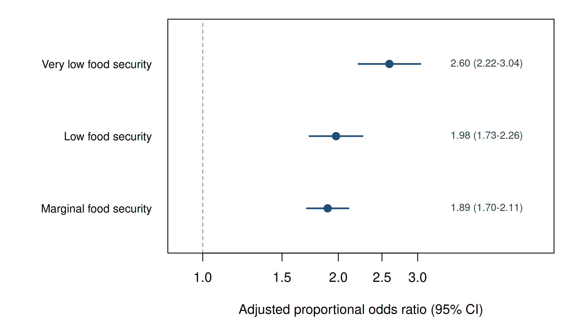

# Household Food Security and Self-Rated Health

## Overview

This project examines whether household food security is associated with
self-rated general health among U.S. adults in the 2024 National Health
Interview Survey. The analysis incorporates the NHIS final annual weight,
strata, and primary sampling units and uses a common complete-case cohort
of 30,230 adults.

## Key finding

Compared with adults reporting high food security, adults reporting very
low food security had 2.60 times the adjusted cumulative odds of worse
self-rated health (95% CI 2.22–3.04). The association was graded across
marginal, low, and very low food-security categories.

Because NHIS is cross-sectional, these results describe associations and
should not be interpreted as evidence of causation.



## Methods

- Data source: 2024 NHIS Sample Adult public-use file
- Exposure: four-category household food-security status
- Outcome: five-level self-rated general health
- Sample: 30,230 complete-case adults
- Software: R 4.3.3
- Packages: `survey` and `MASS`
- Model: survey-weighted cumulative-logit proportional-odds regression
- Survey variables: `WTFA_A`, `PSTRAT`, and `PPSU`
- Diagnostics: weighted VIF assessment and threshold-specific sensitivity models

## Selected results

| Food-security category | Adjusted POR | 95% CI |
|---|---:|---:|
| Marginal | 1.89 | 1.70–2.11 |
| Low | 1.98 | 1.73–2.26 |
| Very low | 2.60 | 2.22–3.04 |

Reference category: high food security.

## Reproducing the analysis

1. Install R.
2. Install the required packages:

```r
install.packages(c("survey", "MASS"))
